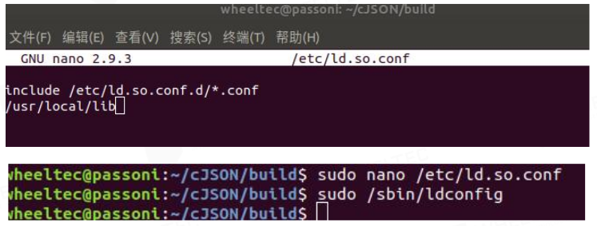

# 语音交互系统_环境搭建与运行

本语音交互系统是实验室为实现机器人语音交流功能而整合开发的一套系统，主要借用各种目前较为理想的开源框架，将**关键词唤醒**、**自适应语音录制**、**语音转文本**、**大模型回答**、**语音合成**各种功能集成于一体，从而初步在**ubuntu系统**中实现语音交互功能（目前在ubuntu20.04和ubuntu22.04均顺利运行）。

##  开源框架选用
- 关键词唤醒：***Porcupine***
- 自适应语音录制：***无开源框架选用，自构建***
- 语音转文本：***FunASR***
- 大模型回答：***openai-deepseek***
- 语音合成：***PaddleSpeech-Streaming_TTS***

## 文件框架
- bin（不重要）
- conf（不重要）
- exp（不重要） 
- local（不重要）
- web（不重要）
- **porcupine_source**（用于关键词识别的相关文件）
  - porcupine_params_zh.pv（中文语音的识别，无需改动）
  - swing.ppn（本系统使用的唤醒词为“小翅膀”，本文件为“小翅膀”的识别文件，可根据自身需求从源网站训练自己的关键词，下载对应的ppn文件进行替换）
- **wav_file**（音频文件，一般无需改动）
  - hear.wav（自适应语音录制模块录制的音频文件，该音频文件会传给FunASR模块）
  - welcome.wav（本人的小trick，唤醒词识别后播放此音频，提醒对话人可以进行对话）
- **voice_awakening.py**(关键词唤醒模块,需更换参数，详见文件内注释说明)
- **record_voice.py**（自适应语音录制模块，可根据实际情况调整文件中的mindb和delayTime参数，详见文件内参数注释）
- **ASR.py**（语音转文本模块，无需改动，仅需按照之后的步骤配置docker即可）
- **deepseek.py**(大模型接入模块，需更换参数，详见文件内注释说明)
- **server_tts.py**（语音合成的服务器模块，无需参数改动，需python运行该文件，先于main.py运行）
- **main.py**（主文件，需python运行该文件）

##  环境配置

### 麦克风M260C串口配置
因本实验室采用科大讯飞M260C版六麦阵列，故需预先配置相关串口，且本实验室对麦克风阵列硬件配制稍作改动，因此非实验室配置者需自行参考麦克风的配置文档，并忽略以下串口配置内容。

#### 麦克风串口配置

1.  把录音设备接入 linux 主机，在终端输入 ll /dev 可以查看到 ttyUSB0
2.  查找/dev/ttyUSB0的idProduct和idVendor信息
```bash
udevadm info -a  /dev/ttyUSB0
```
在其中找到**looking at parent device '/devices/pci0000:00/0000:00:08.1/0000:65:00.3/usb1':**

其中的idProduct和idVendor信息即为所需信息

3.  进入[**iFLYTEK_M260C_microphone_config**]文件夹，打开ch9102_udev.sh，将其中的idProduct和idVendor更换为上述所得的数字，保存后赋权限并运行文件即可。
```bash
sudo chmod +x ch9102_udev.sh

sudo ./ch9102_udev.sh
```

####  cjson 安装
首先通过github获取cJSON文件
```bash
git clone https://github.com/DaveGamble/cJSON.git
```
进入cJSON文件夹，输入如下指令完成安装
```bash
mkdir build
cd build
cmake ..
make
sudo make install
```
还需要将/usr/local/lib 目录添加到 /etc/ld.so.conf 文件中，并执行 /sbin/ldconfig，参考下图

<center>
    
</center>

### 运行环境配置
首先在ubuntu中安装anaconda/miniconda，并创建conda环境
```bash
conda create -n Paddle python=3.8

conda activate Paddle
```
依次执行以下指令
```bash
git clone https://github.com/PaddlePaddle/PaddleSpeech.git

cd PaddleSpeech

pip install python-dateutil

pip install packaging

pip install importlib-resources

pip install paddlepaddle==2.6.1 -f https://www.paddlepaddle.org.cn/whl/linux/mkl/avx/stable.html

pip install pytest-runner -i https://pypi.tuna.tsinghua.edu.cn/simple

pip install . -i https://pypi.tuna.tsinghua.edu.cn/simple

pip install playsound

sudo apt-get install portaudio19-dev python-all-dev python3-all-dev 

pip install pyaudio

pip install pvporcupine

pip install pvrecorder

pip install wave
```

完成环境配置

## 实际运行
运行时，确保在每个终端都执行了环境激活
```bash
conda activate Paddle
```
运行时，首先在一个终端运行
```bash
python server_tts.py
```
这一步是启动tts的服务端;

然后新开一个终端，运行
```bash
python main.py
```
即可正常启动语音交互系统

**ATTENTION：在运行前，请不要忘记修改各个文件中需要补充和微调的参数**

##  报错解决

运行main.py或server_tts.py过程中，有可能会产生一些报错，例如出现报错ImportError: libssl.so.1.1: cannot open shared object file。

解决方法：

先找到系统中这些文件所在的位置
```bash
sudo find / -name libssl.so.1.1
```
用其中随便一个文件的地址作出如下更改：
```bash
sudo cp /home/zero/anaconda3/envs/pytorch/lib/libssl.so.1.1（该地址请自行更改） /usr/lib
```
此时会发现该报错已经消失，但是有可能出现新的相似报错，用该方法同样可以解决


